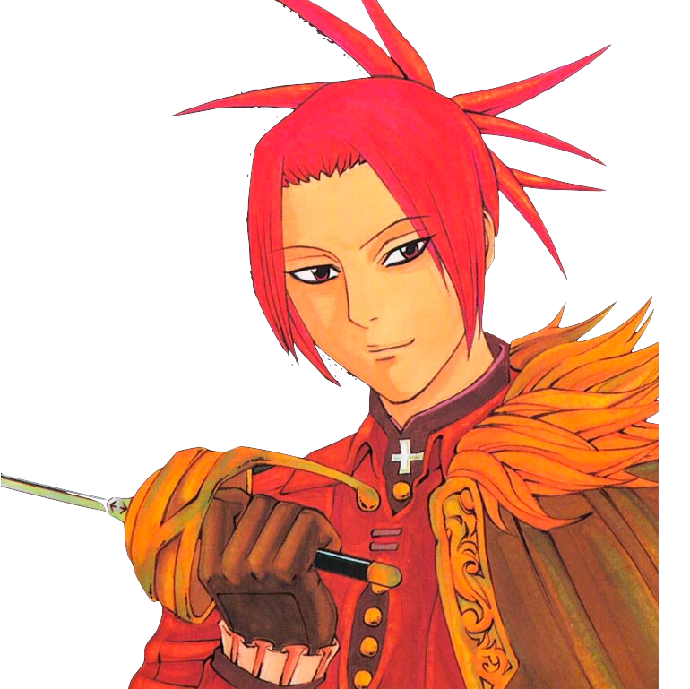
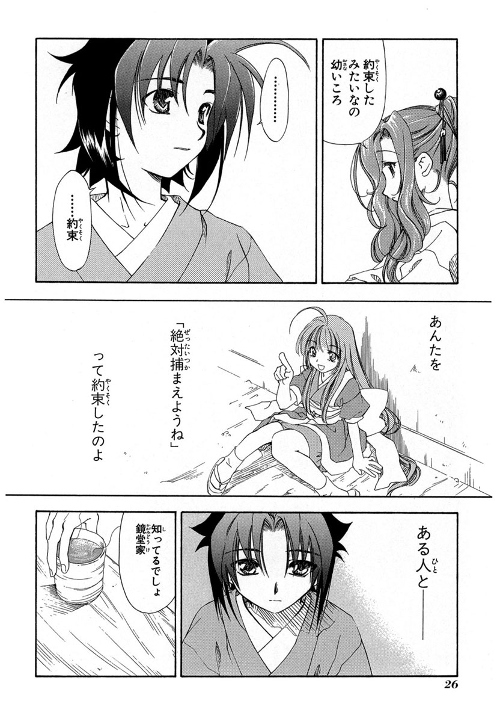
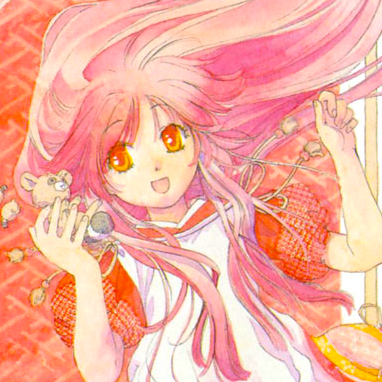
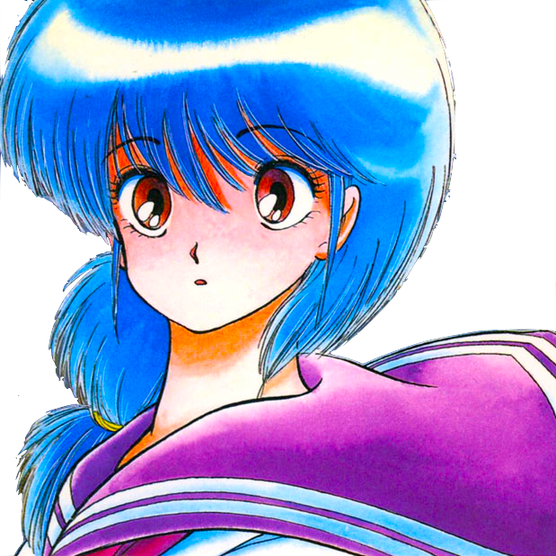

# Comicolorization

## Use Trained Model
```bash
python sample/sample.py
```

* optional arguments
* `--reference_images`: reference images
* `--comicolorizatoin_model_directory`: the trained model directory for the comicolorization task.
* `--comicolorizatoin_model_iteration`: the trained model iteration for the comicolorization task.
* `--super_resolution_model_directory`: the trained model directory for the super resolution task.
* `--super_resolution_model_iteration`: the trained model iteration for the super resolution task.
* `--gpu`: gpu number (-1 means the cpu mode).
* `--output`: the path of colorized image.

## Training

### Colorization Task

### Super Resolution Task
#### 1. modify config file
Modify the information with these keys in `bin/config_super_resolution.json`.
* `dataset/images_glob`: set the image file names
* `model/other/path_result_directory`: set the colorization model directory
* `project/name`: set the name of this task (this will be the directory name)
* `project/result_path`: set the path for the result directory

#### 2. run
```bash
python bin/train_super_resolution.py bin/config_super_resolution.json
```

## Copyright
* We cite monochrome mangas from [Manga109 dataset](http://www.manga109.org/).
*  ©Ishioka Shoei
*  ©Sakurano Minene
*  ©Sakurano Minene
*  ©Tanaka Masato
